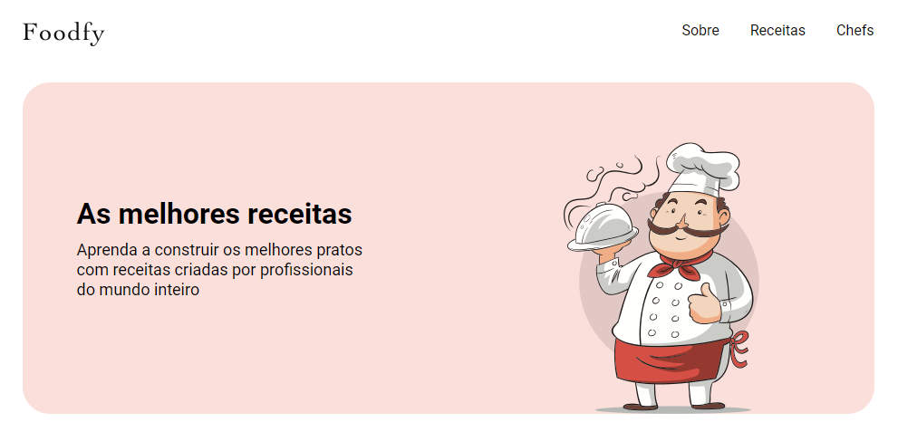

# Foodfy


Foodfy is a community recipe repository, where people can create and share their favorite recipes.
Created during the Launchbase bootcamp, as a completion project.



## Installation

First of all, to run this application you need to have to setup the database indicated in ```database.sql```. 
With the database configurated you can run the commands bellow:

```sh
yarn install
node seed.js
yarn start
```
you can use both <strong>yarn</strong> or <strong>npm</strong>

The default password for any user created is '1234'. The admin users are randomly created.

## Contributing

1. Fork it (<https://github.com/ricassiocosta/foodfy/fork>)
2. Create your feature branch (`git checkout -b feature/fooBar`)
3. Commit your changes (`git commit -am 'Add some fooBar'`)
4. Push to the branch (`git push origin feature/fooBar`)
5. Create a new Pull Request

## Who am I?

Ricássio Costa – [Linkedin](https://linkedin.com/in/ricassiocosta) – riksiocosta@gmail.com

Distributed under the MIT license. See ``LICENSE`` for more information.

<!-- Markdown link & img dfn's -->
[npm-image]: https://img.shields.io/npm/v/datadog-metrics.svg?style=flat-square
